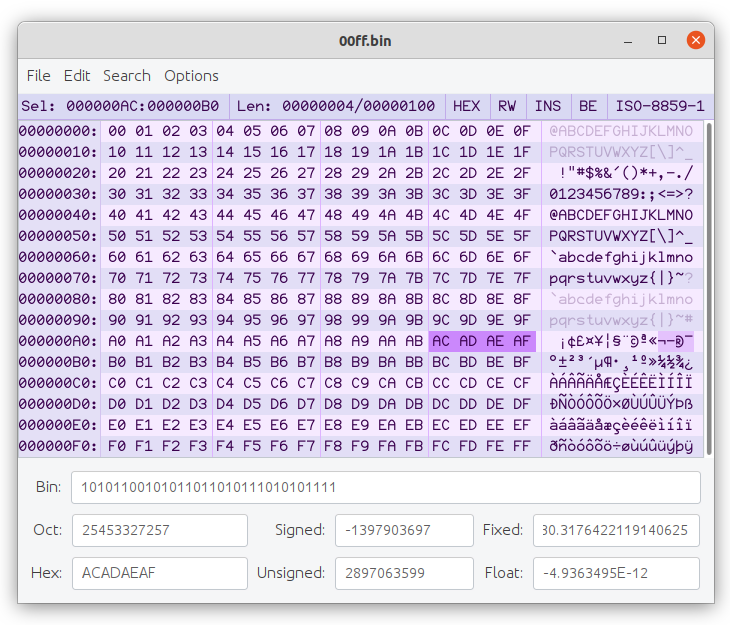
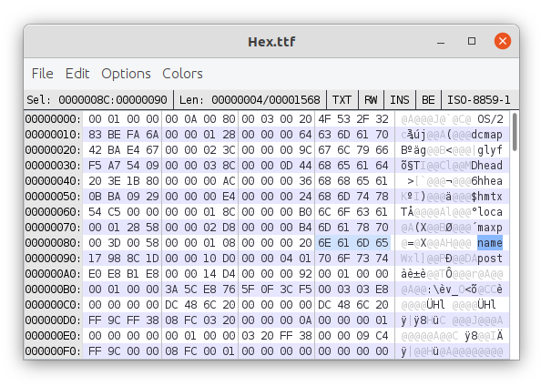

# Hexcellent

A hex editor. Includes these features:

* Does not require an existing file to edit
* Unlimited undo and redo
* Full copy and paste functionality of both hex and text
* Find and replace
* Customizable font and color scheme
* User-settable text encoding
* Data inspector supporting both big-endian and little-endian values

## Power Keys

When Power Keys are enabled and the focus is on the hex side of the editor, the following keys will have the following effects:

* `Z` - Replace selection with all zeros (`00 00`)
* `Y` - Replace selection with all ASCII spaces (`20 20`)
* `X` - Replace selection with all ones (`FF FF`)
* `I` - Invert selected bits (`00 00` → `FF FF` and vice versa)
* `V` - Replace selection with random data
* `S` - Swap selected bytes / reverse endianness (`01 02` → `02 01` and vice versa)
* `N` - Swap selected nybbles (`12 34` → `43 21` and vice versa)
* `R` - Swap selected bits (`80 00` → `00 01` and vice versa)
* `[` - Rotate selected bits to the left (`ROL`)
* `]` - Rotate selected bits to the right (`ROR`)
* `<` - Shift selected bits to the left (`ASL`)
* `>` - Shift selected bits to the right with sign extension (`ASR`)
* `?` - Shift selected bits to the right with zero extension (`LSR`)
* `+` - Increment selected value
* `-` - Decrement selected value
* `H` - Switch between hex and decimal addresses
* `L` - Switch between big and little endian

## The Backstory

I went looking for a (graphical) hex editor on Linux. After trying several (GHex, Bless, Okteta, wxHexEditor), I was disappointed to find not a single one that didn't have at least one of the following issues:

* Requires an existing file to edit
* Copy and paste limited to the text side
* Copy and paste limited to the hex side
* Copy and paste on the hex side picky about whitespace
* Copy and paste completely broken
* Saving completely broken

I had had enough of everything I tried not getting the basics right and decided to do what I always do in these situations: write my own. I had in fact already written one years ago, inspired by an old Macintosh program called HexEdit, as part of a project called Resplendence. So I took a look at my decade-old code, said "what a mess," started over, and rewrote it as a standalone application.

Be hexcellent to each other.
